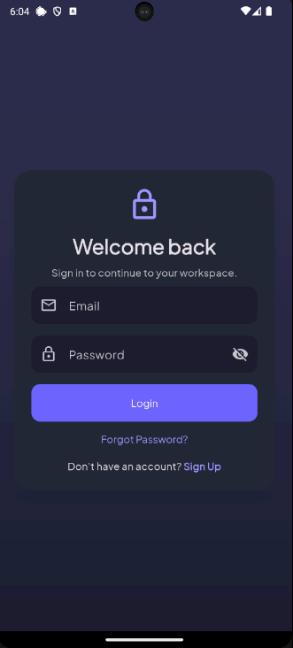
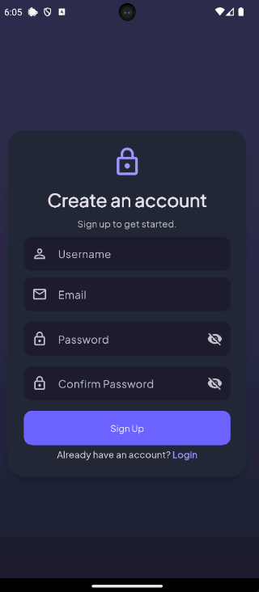

# Smart Productivity App

A modern **AI-powered productivity application** built with Flutter and Supabase. The app brings tasks, habits, notes, Pomodoro focus sessions, AI assistance, calendar events, notifications, analytics, and profile management into one place.

> **Project type:** Final-year / academic project  
> **Platform:** Android  
> **Distribution:** Release APK for project/demo use  
> **Status:** Completed

---

## 📱 Overview

**Smart Productivity App** is designed to help users organize daily work, maintain habits, focus with Pomodoro sessions, plan schedules, and use AI for productivity assistance.

The Home Dashboard brings together progress, current streaks, AI planning, upcoming deadlines, quick actions, recent notes, and productivity information.

---

## ✨ Features

### 🔐 Authentication
- User registration with username, email, and password
- Supabase email confirmation
- Login and logout
- Forgot password and password reset
- Native Android deep-link authentication
- User-friendly authentication error handling
- Persistent profile information

### 🏠 Home Dashboard
- Personalized greeting
- Current habit streak
- Today's progress
- AI Daily Planner
- Upcoming task deadlines
- Quick access to productivity tools
- Recent notes
- Productivity summary
- Riverpod-based state refresh

### 🤖 AI Chat
- AI productivity assistant
- Daily planning assistance
- Task suggestions
- Note summarization
- Productivity recommendations
- Conversation history

### ✅ Task Management
- Create, edit, delete and complete tasks
- Priority management
- Categories
- Due date and time
- Upcoming deadline tracking
- Overdue task highlighting

### 🔥 Habit Tracking
- Create and manage habits
- Daily completion
- Current and best streaks
- Habit reminders
- Completion history
- 12-hour reminder time display

### ⏱️ Pomodoro
- Flexible focus timer
- Custom focus duration
- Custom short break
- Custom long break
- Long-break interval
- Session tracking
- Local notifications

### 📝 Notes
- Create, edit and delete notes
- Recent notes
- Quick access from Home

### 📅 Calendar
- Monthly calendar
- Weekly/daily agenda support
- Tasks and custom events
- Event categories and colors
- Start/end date and time
- Description, location and notes
- Edit/delete events
- Supabase synchronization

### 🔔 Notifications
- Task reminders
- Habit reminders
- Pomodoro notifications
- Daily notifications
- Notification history
- Read/unread state
- Sound and vibration preferences

### 👤 Profile
- Edit username
- Profile picture upload
- Camera/gallery selection
- Supabase Storage
- Change password
- Appearance settings
- Notification settings

### 📊 Analytics
- Tasks completed/created
- Habits completed
- Focus minutes
- Pomodoro session count
- Daily productivity statistics
- Server-side `daily_stats` view

---

## 🖼️ Screenshots

### Login



### Sign Up



> Additional Home, AI Chat, Tasks, Habits, Calendar, Profile, and Notification screenshots can be added under `assets/screenshots/`.

---

## 🛠️ Tech Stack

| Technology | Purpose |
|---|---|
| **Flutter** | Application framework |
| **Dart** | Programming language |
| **Riverpod** | State management |
| **GoRouter** | Navigation and routing |
| **Supabase** | Backend platform |
| **PostgreSQL** | Database |
| **Supabase Auth** | Authentication |
| **Supabase Storage** | Profile image storage |
| **Gemini API** | AI productivity features |
| **flutter_local_notifications** | Local reminders |
| **flutter_dotenv** | Environment configuration |
| **Clean Architecture** | Application architecture |

---

## 🏗️ Architecture

The project follows a feature-based Clean Architecture approach.

```text
lib/
├── core/
│   ├── ai/
│   ├── constants/
│   ├── providers/
│   ├── theme/
│   └── utils/
│
├── features/
│   ├── auth/
│   ├── home/
│   ├── tasks/
│   ├── habits/
│   ├── notes/
│   ├── pomodoro/
│   ├── calendar/
│   ├── notifications/
│   ├── profile/
│   ├── analytics/
│   └── chat/
│
└── routes/
```

Riverpod manages application state while Supabase provides authentication, database, storage, and synchronization.

---

## 🗄️ Database

Main Supabase objects:

- `profiles`
- `tasks`
- `categories`
- `notes`
- `habits`
- `habit_logs`
- `pomodoro_sessions`
- `notification_settings`
- `notifications`
- `calendar_events`
- `chat_conversations`
- `chat_messages`
- `daily_stats` — view

### Main relationships

```text
profiles
 ├── tasks
 │    └── pomodoro_sessions
 ├── categories
 ├── notes
 ├── habits
 │    └── habit_logs
 ├── calendar_events
 ├── notification_settings
 ├── notifications
 └── chat_conversations
      └── chat_messages

daily_stats
 └── computed from productivity data
```

---

## 🔗 Authentication Deep Links

### Email confirmation

```text
smartproductivity://auth-callback
```

### Password reset

```text
smartproductivity://reset-password
```

These URLs must be registered in the Supabase Authentication URL Configuration.

---

## 🚀 Running the Project

### Install dependencies

```bash
flutter pub get
```

### Environment configuration

Configure the environment values required by the project:

```env
SUPABASE_URL=your_supabase_url
SUPABASE_ANON_KEY=your_supabase_anon_key
GEMINI_API_KEY=your_gemini_api_key
```

Never commit real production secrets to GitHub.

### Run

```bash
flutter run
```

---

## 📦 Release APK

This project is intended for **Android APK distribution for academic/demo purposes**, not Play Store or App Store deployment.

Build:

```bash
flutter clean
flutter pub get
flutter build apk --release
```

APK location:

```text
build/app/outputs/flutter-apk/app-release.apk
```

The generated APK can be copied to an Android phone and installed for demonstration/testing.

---

## 🧪 Verification

Before the final APK:

```bash
flutter analyze
```

```bash
flutter build apk --release
```

Verify:

- Authentication
- Email confirmation
- Password reset
- Home dashboard
- Tasks
- Habits
- Streak calculation
- Pomodoro
- Notes
- AI Chat
- Calendar
- Custom events
- Notifications
- Notification history
- Profile name
- Profile picture
- Theme switching
- Analytics
- Supabase synchronization

---

## 🎯 Project Goals

1. Organize daily activities in one application.
2. Use AI to assist with planning and productivity.
3. Help users maintain consistent habits.
4. Improve focus using Pomodoro sessions.
5. Provide useful productivity analytics.
6. Remind users about important tasks and habits.
7. Synchronize productivity data through Supabase.

---

## 👨‍💻 Project

**Smart Productivity App**

Built with:

**Flutter + Dart + Riverpod + Supabase + Gemini AI**

Developed as an academic/final-year project.

---

## 📄 License

This project is created for academic and project demonstration purposes.
