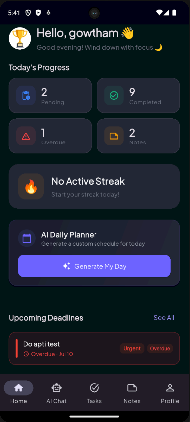
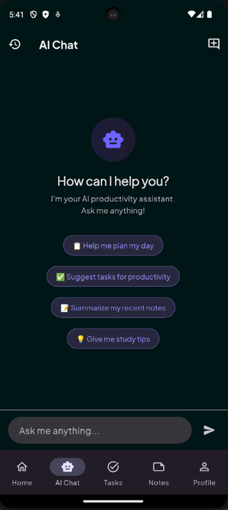
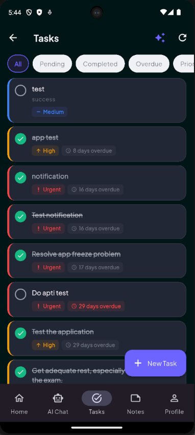
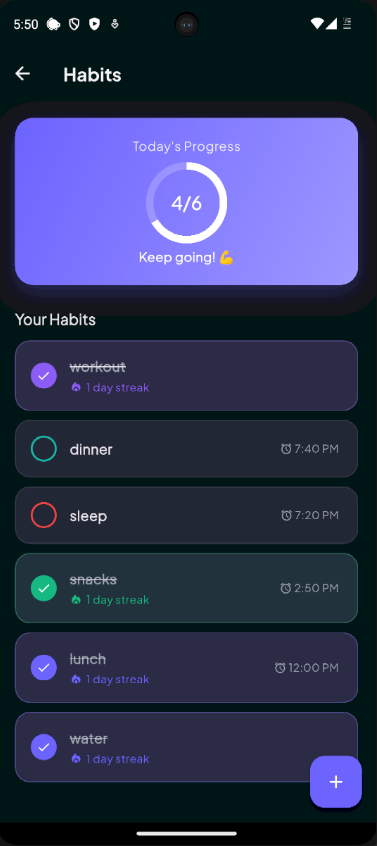
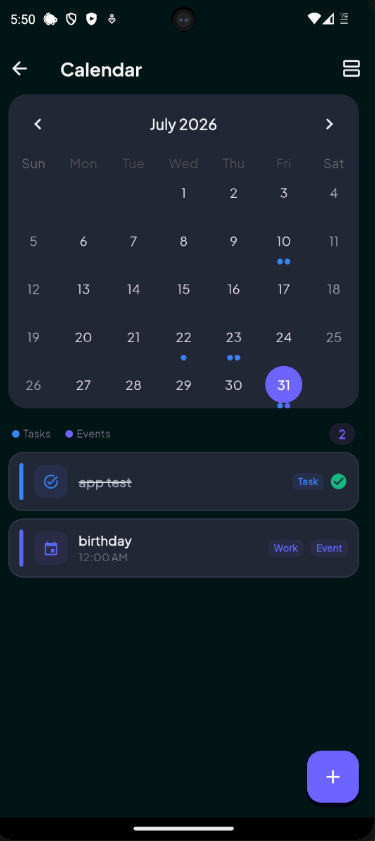
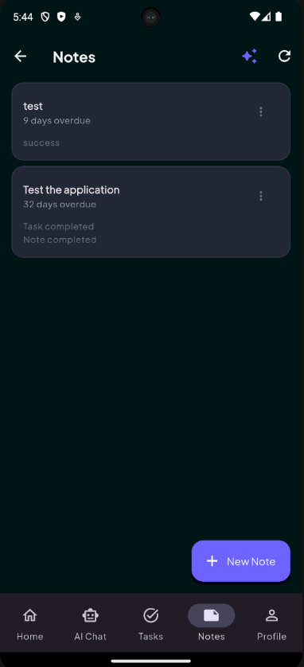
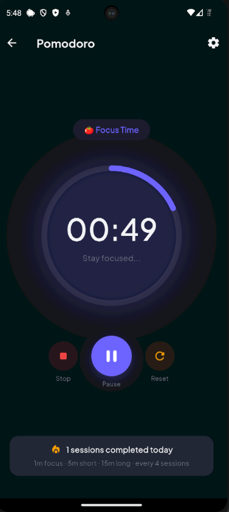
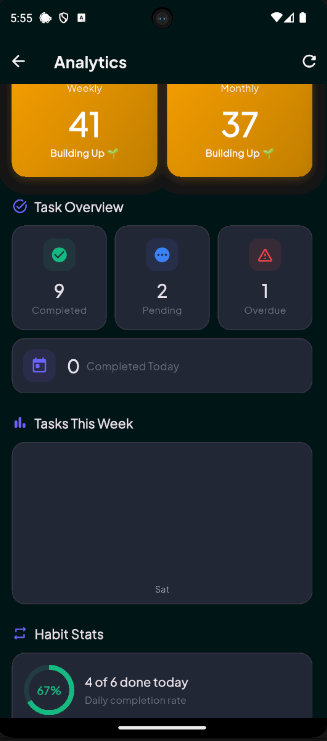
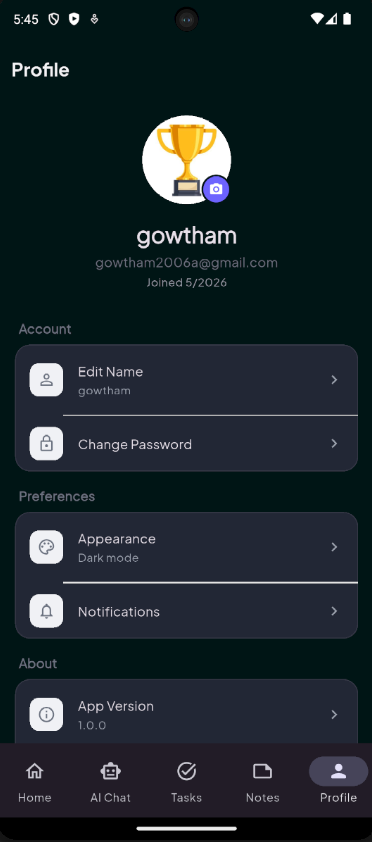

# Smart Productivity App

A modern **AI-powered productivity application** built with Flutter and Supabase.

Smart Productivity App combines task management, habit tracking, notes, Pomodoro focus sessions, AI assistance, calendar events, notifications, analytics, and profile management into a single productivity workspace.

> **Platform:** Android  
> **Distribution:** Release APK  
> **Status:** Completed

## 📥 Download

[](https://github.com/gowtham142006/smart-productivity-app/releases/latest)
> Android only. This APK is provided for personal use, testing, and demonstration.

---

## 📱 Overview

Smart Productivity App is designed to help users organize their daily activities, maintain consistent habits, manage tasks, focus with Pomodoro sessions, and use AI to improve their productivity.

The Home Dashboard provides a quick overview of:

- Today's progress
- Current streak
- AI Daily Planner
- Upcoming deadlines
- Quick actions
- Recent notes
- Productivity summary

The application uses **Flutter for the frontend** and **Supabase for authentication, database, storage, and synchronization**.

---

## 💡 Why I Built This

I built Smart Productivity App as a personal project to explore how AI can be integrated into a real-world productivity application.

Instead of building only a basic task manager, I wanted to combine multiple productivity features into one application and learn how to handle:

- AI-powered productivity features
- Application state management
- Authentication and password recovery
- Cloud database synchronization
- Local notifications
- File and image storage
- Calendar events
- Habit streak calculations
- Productivity analytics
- Android deep linking
- Production APK builds

---

## ✨ Features

### 🔐 Authentication

- User registration with username, email, and password
- Supabase email confirmation
- Login and logout
- Forgot password and password reset
- Native Android deep-link authentication
- Password recovery through native Android deep links
- Authentication error handling
- Persistent user profile information

### 🏠 Home Dashboard

- Personalized greeting
- Current habit streak
- Today's progress
- AI Daily Planner
- Upcoming task deadlines
- Quick access to productivity tools
- Recent notes
- Productivity summary
- Riverpod-based state management

### 🤖 AI Chat

- AI productivity assistant
- Daily planning assistance
- Task suggestions
- Note summarization
- Productivity recommendations
- Conversation history

### ✅ Task Management

- Create, edit, delete and complete tasks
- Priority management
- Categories
- Due date and time
- Upcoming deadline tracking
- Overdue task highlighting

### 🔥 Habit Tracking

- Create and manage habits
- Daily completion
- Current and best streaks
- Habit reminders
- Completion history
- 12-hour reminder time display

### ⏱️ Pomodoro

- Custom focus duration
- Custom short break
- Custom long break
- Long-break interval
- Session tracking
- Local notifications

### 📝 Notes

- Create, edit and delete notes
- Recent notes
- Quick access from Home

### 📅 Calendar

- Monthly calendar
- Weekly/daily agenda
- Task display
- Custom calendar events
- Event categories
- Event colors
- Start/end date and time
- Description
- Location
- Notes
- Edit/delete events
- Supabase synchronization

### 🔔 Notifications

- Task reminders
- Habit reminders
- Pomodoro notifications
- Daily notifications
- Notification history
- Read/unread state
- Sound and vibration preferences

### 👤 Profile

- Edit username
- Profile picture upload
- Camera/gallery selection
- Supabase Storage integration
- Change password
- Appearance settings
- Notification settings

### 📊 Analytics

- Tasks completed
- Tasks created
- Habits completed
- Focus minutes
- Pomodoro session count
- Daily productivity statistics
- Server-side `daily_stats` view

---

## 🖼️ Application Screenshots

### 🔐 Authentication

<p align="center">
  
  
</p>

### 🏠 Core Experience

<p align="center">
  
  
  
</p>

<details>
<summary>✨ View more screenshots</summary>

### 🔥 Habits

<p align="center">
  
</p>

### 📅 Calendar

<p align="center">
  
</p>

### 📝 Notes

<p align="center">
  
</p>

### ⏱️ Pomodoro

<p align="center">
  
</p>

### 📊 Analytics

<p align="center">
  
</p>

### 👤 Profile

<p align="center">
  
</p>

</details>

---

## 🛠️ Tech Stack

| Technology | Purpose |
|---|---|
| **Flutter** | Application framework |
| **Dart** | Programming language |
| **Riverpod** | State management |
| **GoRouter** | Navigation and routing |
| **Supabase** | Backend platform |
| **PostgreSQL** | Database |
| **Supabase Auth** | Authentication |
| **Supabase Storage** | Profile image storage |
| **Gemini API** | AI productivity features |
| **flutter_local_notifications** | Local reminders |
| **flutter_dotenv** | Environment configuration |
| **Clean Architecture** | Application architecture |

---

## 🏗️ Architecture

The project follows a feature-based Clean Architecture approach.

```text
lib/
├── core/
│   ├── ai/
│   ├── constants/
│   ├── providers/
│   ├── theme/
│   └── utils/
│
├── features/
│   ├── auth/
│   ├── home/
│   ├── tasks/
│   ├── habits/
│   ├── notes/
│   ├── pomodoro/
│   ├── calendar/
│   ├── notifications/
│   ├── profile/
│   ├── analytics/
│   └── chat/
│
└── routes/
```

Riverpod manages application state while Supabase provides authentication, database, storage, and synchronization.

---

## 🗄️ Database

Main Supabase objects:

- `profiles`
- `tasks`
- `categories`
- `notes`
- `habits`
- `habit_logs`
- `pomodoro_sessions`
- `notification_settings`
- `notifications`
- `calendar_events`
- `chat_conversations`
- `chat_messages`
- `daily_stats` — view

### Main Relationships

```text
profiles
 ├── tasks
 │    └── pomodoro_sessions
 ├── categories
 ├── notes
 ├── habits
 │    └── habit_logs
 ├── calendar_events
 ├── notification_settings
 ├── notifications
 └── chat_conversations
      └── chat_messages

daily_stats
 └── computed from productivity data
```

---

## 🔗 Authentication Deep Links

### Email Confirmation

```text
smartproductivity://auth-callback
```

### Password Reset

```text
smartproductivity://reset-password
```

These URLs are configured in Supabase Authentication and handled by the native Android application.

---

## 🔒 Security

The application uses Supabase Authentication and Row Level Security to protect user data.

User-specific data is isolated so users can access only their own:

- Tasks
- Categories
- Habits
- Habit logs
- Notes
- Calendar events
- Notifications
- Notification settings
- Chat conversations
- Chat messages
- Profile information

Sensitive configuration values are stored through environment variables rather than being hard-coded into the application.

> Never commit real API keys, passwords, service-role keys, or other secrets to GitHub.

---

## 🚀 Getting Started

### Prerequisites

- Flutter SDK
- Android Studio
- Android SDK
- Supabase project
- Gemini API key

### Install dependencies

```bash
flutter pub get
```

### Environment Configuration

Configure the required environment values:

```env
SUPABASE_URL=your_supabase_url
SUPABASE_ANON_KEY=your_supabase_anon_key
GEMINI_API_KEY=your_gemini_api_key
```

### Run the application

```bash
flutter run
```

---

## 📦 Release APK

The application is distributed as an **Android Release APK** for personal use, testing, and demonstration.

Build the release APK:

```bash
flutter clean
flutter pub get
flutter build apk --release
```

The generated APK is located at:

```text
build/app/outputs/flutter-apk/app-release.apk
```

The APK can be transferred to an Android device and installed directly.

---

## 🧪 Verification

Before generating a release build:

```bash
flutter analyze
```

```bash
flutter build apk --release
```

The following areas were verified:

- Authentication
- Email confirmation
- Password reset
- Home Dashboard
- Tasks
- Habits
- Streak calculation
- Pomodoro
- Notes
- AI Chat
- Calendar
- Custom events
- Notifications
- Notification history
- Profile
- Profile picture
- Theme switching
- Analytics
- Supabase synchronization

---

## 🔮 Future Improvements

Possible future improvements include:

- AI-powered automatic task prioritization
- Smarter productivity recommendations
- Advanced productivity analytics
- More notification customization
- AI-based habit recommendations
- External calendar integrations
- Improved offline synchronization
- Additional platform support

---

## 👨‍💻 Project

**Smart Productivity App**

Built independently using:

**Flutter + Dart + Riverpod + Supabase + Gemini AI**

A personal project focused on combining **AI, productivity management, cloud services, and modern mobile application architecture**.

---

## 📄 License

This project is intended for personal learning, development, and demonstration purposes.
